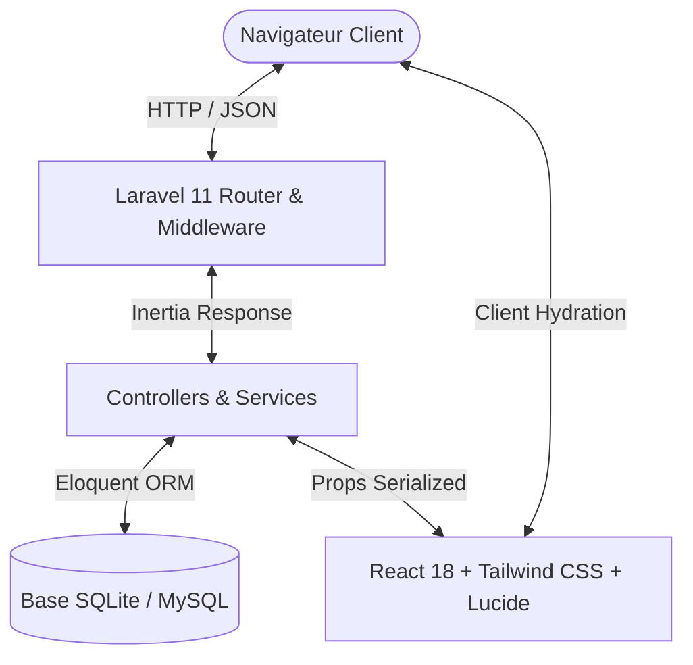

<div align="center">

# 🚀 PULSE — Plateforme de Jumelage Étudiant
### Cégep de Trois-Rivières (CEGPTR)

[](https://laravel.com)
[](https://reactjs.org/)
[](https://inertiajs.com/)
[](https://tailwindcss.com/)
[](https://www.docker.com/)
[](https://www.sqlite.org/)

<p align="center">
  Une plateforme web innovante et réactive reliant les étudiants du <strong>Cégep de Trois-Rivières</strong> par affinités académiques, projets d'études et passions communes.
</p>

[Fonctionnalités](#-fonctionnalités-clés) •
[Démarrage Rapide](#-démarrage-rapide) •
[Déploiement Docker](#-lancement-via-docker-recommandé-sans-installation-locale) •
[Installation Locale](#-installation-locale-avec-laravel--php) •
[Comptes Démo](#-comptes-de-démonstration) •
[Architecture](#-architecture-technique) •
[Auteurs](#-équipe-de-développement)

---

</div>

## 📌 Sommaire

- [Aperçu du Projet](#-aperçu-du-projet)
- [Fonctionnalités Clés](#-fonctionnalités-clés)
- [Démarrage Rapide](#-démarrage-rapide)
  - [Méthode 1 : Script 1-Clic (Recommandé)](#méthode-1--script-automatique-1-clic)
  - [Méthode 2 : Docker & Docker Compose](#-lancement-via-docker-recommandé-sans-installation-locale)
  - [Méthode 3 : Installation Locale Manuelle](#-installation-locale-avec-laravel--php)
- [Comptes de Démonstration](#-comptes-de-démonstration)
- [Architecture Technique](#-architecture-technique)
- [Structure du Projet](#-structure-du-projet)
- [Scripts Utiles](#-scripts-et-commandes-utiles)
- [Équipe de Développement](#-équipe-de-développement)

---

## 📖 Aperçu du Projet

**Pulse** réinvente la vie étudiante collégiale en offrant un réseau privé sécurisé aux membres du Cégep de Trois-Rivières. Grâce à un algorithme de calcul de compatibilité basé sur les intérêts et le programme d'études, les étudiants peuvent facilement trouver des partenaires de travail, des groupes d'études et participer aux événements du campus.

---

## ✨ Fonctionnalités Clés

- 🎯 **Algorithme de Jumelage Intelligent** : Analyse en temps réel des centres d'intérêt partagés et calcul dynamique d'un score d'affinité.
- 💬 **Messagerie & Conversations Directes** : Échanges textuels directs et instantanés entre étudiants jumelés.
- 👥 **Groupes & Cercles Thématiques** : Espaces collaboratifs publics ou privés pour réviser, organiser des projets ou échanger autour d'un sujet.
- 📅 **Gestion des Événements du Campus** : Planification de rencontres, inscriptions avec jauge de participants et invitations de contacts en un clic.
- 🛡️ **Panel Administrateur & Modération Avancée** :
  - Supervision et gestion des comptes utilisateurs.
  - Bannissement / suspension temporaire avec blocage strict d'accès.
  - Gestion dynamique du catalogue des centres d'intérêt.
  - Traitement des signalements de contenu ou de comportements inappropriés.
- 🔒 **Sécurité Renforcée & Cégep Flow** :
  - Restrictions institutionnelles (`@edu.cegeptr.qc.ca`).
  - Validation de compte par code à usage unique.
  - Question de secours secrète pour réinitialiser son mot de passe en toute autonomie.
- 🌐 **Bilinguisme Intégré (FR / EN)** : Bascule linguistique fluide instantanée sans rechargement de page.

---

## ⚡ Démarrage Rapide

Choisissez la méthode qui correspond le mieux à votre environnement :

### Méthode 1 : Script Automatique 1-Clic

Si vous avez **PHP (8.2+)**, **Composer** et **Node.js (18+)** installés, vous pouvez tout initialiser et lancer en **une seule commande** :

#### 🪟 Sur Windows (Double-clic) :
Double-cliquez directement sur **`start.bat`** depuis l'explorateur Windows, ou dans un terminal CMD/PowerShell :
```cmd
start.bat
```

#### 🐧 Sur Linux / macOS / Git Bash :
```bash
chmod +x start.sh
./start.sh
```

> **Ce que fait le script automatiquement pour vous :**
> 1. Crée le fichier `.env` depuis `.env.example` s'il n'existe pas.
> 2. Génère une clé d'application sécurisée (`APP_KEY`).
> 3. Installe les dépendances PHP (`vendor/`) et Node (`node_modules/`) si absentes.
> 4. Compile les assets graphiques React & Tailwind avec Vite (`public/build`).
> 5. Crée le fichier SQLite `database/database.sqlite` et exécute les migrations et les seeders.
> 6. Configure le lien symbolique du stockage (`storage:link`).
> 7. Ouvre automatiquement votre navigateur sur **`http://127.0.0.1:8000`** !

---

### 🐳 Lancement via Docker (Sans Rien Installer Localement)

Si vous possédez **Docker** et **Docker Compose**, vous n'avez pas besoin d'installer PHP, Composer ou Node sur votre ordinateur :

#### Avec les scripts rapides :
- **Windows** : Double-cliquez sur `docker-run.bat`
- **Linux / macOS** : Exécutez `./docker-run.sh`

#### Ou directement via Docker Compose :
```bash
docker compose up --build -d
```

L'application sera immédiatement accessible sur : **`http://localhost:8000`**

- **Voir les logs en direct :** `docker compose logs -f`
- **Arrêter le conteneur :** `docker compose down`

---

### 💻 Installation Locale Manuelle avec Laravel & PHP

Si vous préférez exécuter les commandes étape par étape :

#### 1. Prérequis
- [PHP 8.2+](https://www.php.net/downloads.php) (avec extensions `pdo_sqlite`, `mbstring`, `gd`, `intl`)
- [Composer](https://getcomposer.org/download/)
- [Node.js 18+](https://nodejs.org/) & NPM

#### 2. Clonage & Dépendances
```bash
# Cloner le dépôt
git clone https://github.com/EsdrasKoami/pulse-cegeptr-app.git
cd pulse-cegeptr-app

# Installer les dépendances backend
composer install

# Installer les dépendances frontend
npm install
```

#### 3. Configuration de l'Environnement
```bash
# Copier le fichier d'exemple
cp .env.example .env

# Générer la clé applicative
php artisan key:generate
```

#### 4. Base de Données (SQLite)
```bash
# Créer le fichier de base de données (si non existant)
touch database/database.sqlite

# Exécuter les migrations et le chargement des données de départ
php artisan migrate --seed
```

#### 5. Lien de Stockage & Compilation
```bash
# Lier le répertoire public au stockage
php artisan storage:link

# Compiler les assets pour la production
npm run build
```

#### 6. Démarrer l'Application
```bash
php artisan serve
```
Rendez-vous sur [http://127.0.0.1:8000](http://127.0.0.1:8000).

*(Optionnel pour le développement avec rechargement à chaud Vite : lancer dans un autre terminal `npm run dev`)*.

---

## 🔑 Comptes de Démonstration

Pour tester immédiatement toutes les fonctionnalités de la plateforme (y compris la modération) :

| Rôle | Adresse Courriel | Mot de passe | Accès & Permissions |
| :--- | :--- | :--- | :--- |
| 🛡️ **Administrateur** | `admin@edu.cegeptr.qc.ca` | `admin123` | Accès complet au tableau de bord, panel admin (`/admin`), modération, utilisateurs et catégories |
| 🎓 **Étudiant Démo** | Création libre via `Inscription` | `password` ou de votre choix | Découverte, création d'événements, cercles d'études, messagerie |

> **Note :** La validation institutionnelle accepte les adresses finissant par `@edu.cegeptr.qc.ca` ou `@cegeptr.qc.ca`.

---

## 🏗️ Architecture Technique



- **Backend :** Laravel 11.x, PHP 8.4
- **Frontend :** React 18, Inertia.js (Monolithe moderne sans API REST superflue)
- **Design & UI :** Tailwind CSS, Lucide Icons, Glassmorphism, Micro-animations fluides
- **Base de données :** SQLite (embarquée, zéro configuration requise) ou MySQL / PostgreSQL
- **Outil de build :** Vite 8
- **Conteneurisation :** Docker multi-stage build (Alpine Linux léger & optimisé)

---

## 📁 Structure du Projet

```text
├── app/
│   ├── Http/
│   │   ├── Controllers/        # Contrôleurs Web & Admin (Auth, Group, Event, User, etc.)
│   │   └── Middleware/         # BannedMiddleware, HandleInertiaRequests...
│   ├── Models/                 # Modèles Eloquent (User, Group, Event, Interest, etc.)
│   └── Services/               # Logique métier & algorithme de recommandation
├── database/
│   ├── migrations/             # Migrations structurant le schéma de base de données
│   ├── seeders/                # Données initiales (intérêts, admin démo)
│   └── database.sqlite         # Fichier de données SQLite local
├── resources/
│   ├── js/
│   │   ├── Components/         # Composants React réutilisables (Cartes, Modales, Panels)
│   │   ├── Layouts/            # Layouts Authenticated & Guest
│   │   ├── Pages/              # Pages Inertia (Dashboard, Admin, Auth, Groups, Events...)
│   │   └── Contexts/           # Contextes globaux (ex: bilinguisme FR/EN)
│   └── views/
│       └── app.blade.php       # Template d'amorçage Blade
├── routes/
│   └── web.php                 # Déclaration des routes applicatives
├── Dockerfile                  # Configuration du conteneur de production
├── docker-compose.yml          # Définition des services Docker Compose
├── start.sh                    # Script bash de démarrage automatique 1-clic (Linux/Mac/Git Bash)
├── start.bat                   # Script batch de démarrage automatique 1-clic (Windows)
└── README.md                   # Documentation du projet
```

---

## 🛠️ Scripts et Commandes Utiles

| Commande | Action |
| :--- | :--- |
| `./start.sh` ou `start.bat` | Lance et configure automatiquement tout le projet |
| `docker compose up --build -d` | Démarre l'application dans un conteneur Docker isolé |
| `php artisan test` | Lance la suite de tests automatisés |
| `php artisan optimize:clear` | Nettoie tous les caches internes (vues, routes, config) |
| `php artisan migrate:fresh --seed` | Réinitialise complètement la base de données avec les données initiales |
| `npm run build` | Compile et minifie les fichiers JavaScript et CSS pour la production |

---

## 👥 Équipe de Développement

Projet conçu et développé avec passion pour la communauté collégiale :

- **KOAMI ESDRAS AMEDJIKO**
- **KEREN LILIA BOMBO**
- **GOUAM SILUE MYRIAM**

*Département d'Informatique — Cégep de Trois-Rivières.*

---

<div align="center">
  <sub>Développé avec fierté pour le CEGPTR. Pulse © 2026. Tous droits réservés.</sub>
</div>
