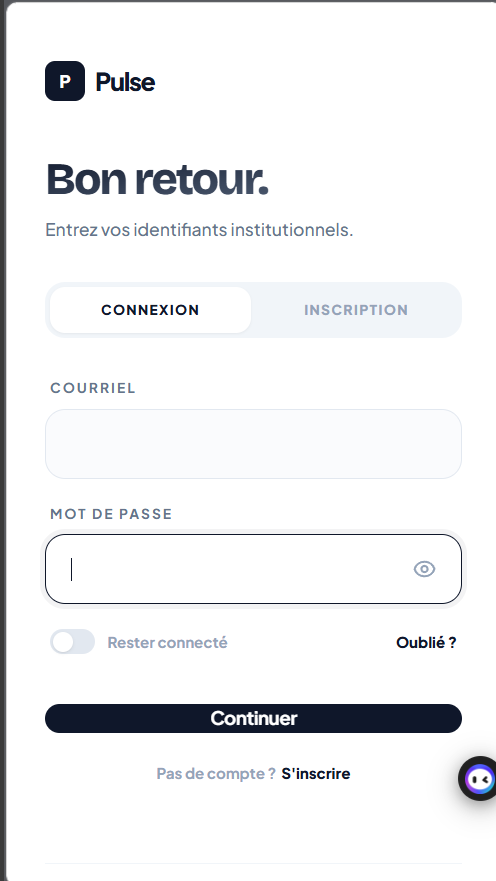
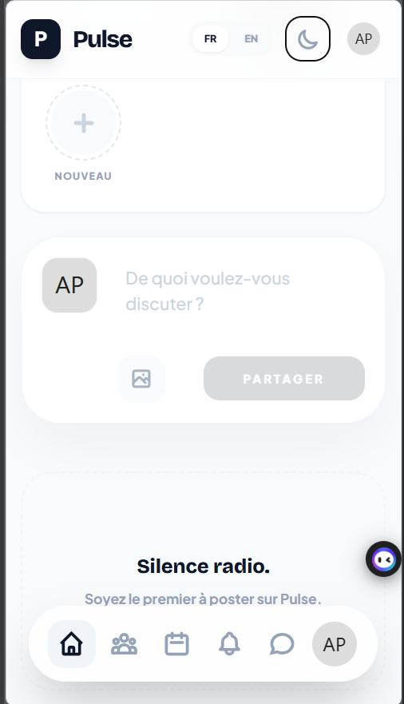
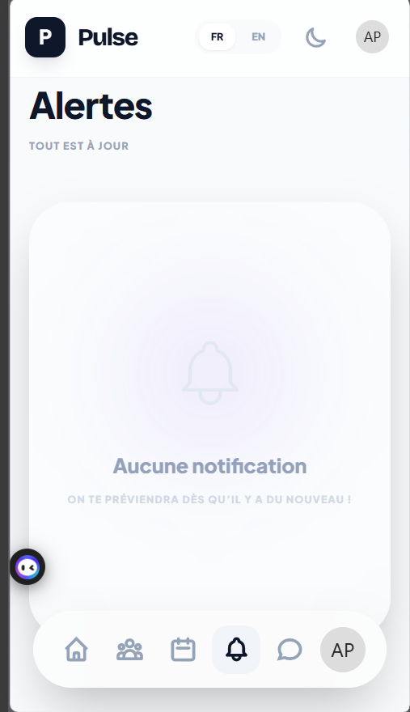
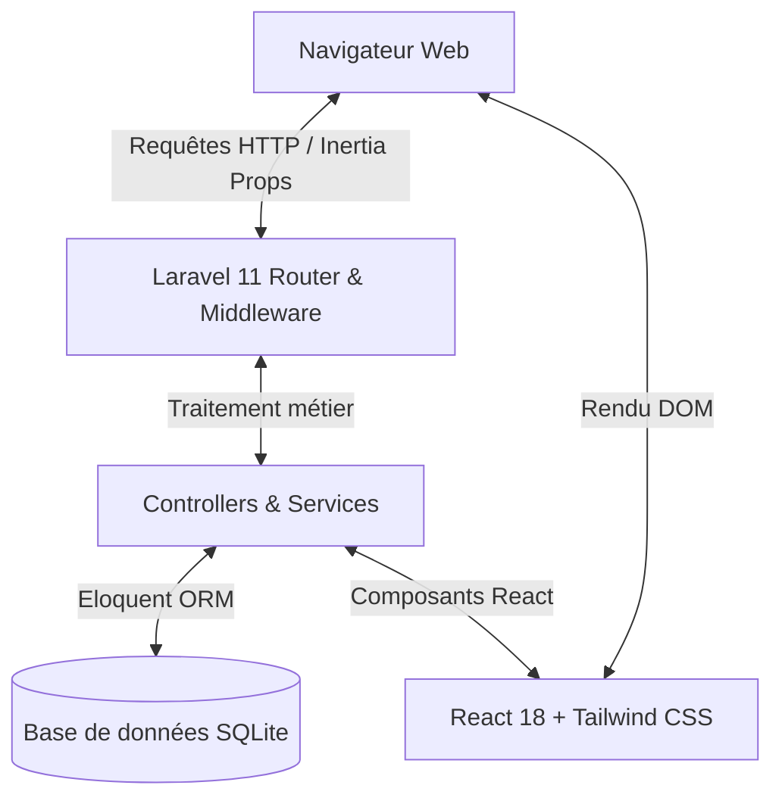

# Pulse — Plateforme de Jumelage Étudiant

> Application web collaborative destinée aux étudiants du Cégep de Trois-Rivières (CEGPTR).

[](https://laravel.com)
[](https://reactjs.org/)
[](https://inertiajs.com/)
[](https://tailwindcss.com/)
[](https://www.docker.com/)
[](https://www.sqlite.org/)
[](https://www.php.net/)

---

## Sommaire

- [Présentation du projet](#présentation-du-projet)
- [Aperçu de l'interface](#aperçu-de-linterface)
- [Fonctionnalités principales](#fonctionnalités-principales)
- [Démarrage rapide (1-clic)](#démarrage-rapide-1-clic)
- [Exécution avec Docker](#exécution-avec-docker)
- [Installation manuelle](#installation-manuelle)
- [Comptes de test](#comptes-de-test)
- [Architecture technique](#architecture-technique)
- [Arborescence du projet](#arborescence-du-projet)
- [Commandes utiles](#commandes-utiles)
- [Contributeurs](#contributeurs)

---

## Présentation du projet

**Pulse** est une plateforme web développée pour dynamiser la vie académique et sociale au sein du Cégep de Trois-Rivières. Elle permet aux étudiants de se jumeler en fonction de leurs centres d'intérêt et de leurs programmes d'études, de créer des groupes de travail et de participer aux activités étudiantes du campus.

---

## Aperçu de l'interface

### Vue Bureau (Desktop)

<p align="center">
  
</p>

### Vues Mobiles

<p align="center">
  
  
  
</p>

<p align="center">
  <em>De gauche à droite : Authentification minimaliste &bull; Fil d'actualité & stories &bull; Centre d'alertes et notifications.</em>
</p>

---

## Fonctionnalités principales

- **Système de jumelage intelligent** : Calcul dynamique d'un indice de compatibilité basé sur les affinités académiques et centres d'intérêt partagés.
- **Messagerie instantanée** : Échanges privés et directs entre membres connectés.
- **Cercles et espaces d'études** : Création de groupes de travail thématiques (publics ou privés).
- **Événements de campus** : Publication d'activités avec gestion des jauges de participants et invitations ciblées.
- **Modération et administration** :
  - Gestion centralisée des utilisateurs et rôles.
  - Système de suspension et bannissement temporaire ou définitif.
  - Administration du catalogue des centres d'intérêt.
  - Traitement des signalements de contenu.
- **Sécurité et flux institutionnel** :
  - Filtrage des inscriptions sur le domaine institutionnel (`@edu.cegeptr.qc.ca` ou `@cegeptr.qc.ca`).
  - Validation par code à usage unique.
  - Récupération de compte via question de sécurité secrète.
- **Support bilingue (FR / EN)** : Changement de langue dynamique côté client.

---

## Démarrage rapide (1-clic)

Si vous disposez de PHP (8.2+), Composer et Node.js sur votre machine, utilisez les scripts d'initialisation automatique inclus à la racine du projet :

### Sous Windows
Double-cliquez sur le fichier `start.bat` ou lancez-le dans un terminal :
```cmd
start.bat
```

### Sous Linux / macOS / Git Bash
```bash
chmod +x start.sh
./start.sh
```

**Actions prises en charge automatiquement par le script :**
1. Création du fichier `.env` depuis `.env.example` si absent.
2. Génération de la clé d'application (`APP_KEY`).
3. Installation des dépendances Composer et NPM si nécessaire.
4. Compilation des assets frontend avec Vite.
5. Création et migration de la base de données SQLite avec chargement des données initiales.
6. Création du lien symbolique de stockage (`storage:link`).
7. Lancement du serveur local sur `http://127.0.0.1:8000`.

---

## Exécution avec Docker

Pour exécuter le projet sans installer PHP, Composer ou Node.js sur la machine hôte :

### Via Docker Compose
```bash
docker compose up --build -d
```

L'application est ensuite accessible sur : **`http://localhost:8000`**

### Commandes utiles Docker
- **Consulter les journaux d'exécution :**
  ```bash
  docker compose logs -f
  ```
- **Arrêter les conteneurs :**
  ```bash
  docker compose down
  ```

*(Des lanceurs `docker-run.bat` pour Windows et `docker-run.sh` pour Linux/macOS sont également fournis).*

---

## Installation manuelle

Pour une configuration manuelle étape par étape :

### 1. Prérequis
- PHP 8.2 ou version ultérieure (extensions requises : `pdo_sqlite`, `mbstring`, `gd`, `intl`, `bcmath`)
- Composer 2.x
- Node.js 18+ & NPM

### 2. Dépendances
```bash
# Cloner le dépôt
git clone https://github.com/EsdrasKoami/pulse-cegeptr-app.git
cd pulse-cegeptr-app

# Dépendances PHP
composer install

# Dépendances JavaScript
npm install
```

### 3. Configuration
```bash
# Fichier d'environnement
cp .env.example .env

# Clé de chiffrement
php artisan key:generate
```

### 4. Base de données
```bash
# Création du fichier SQLite
touch database/database.sqlite

# Migrations et seeders
php artisan migrate --seed
```

### 5. Compilation et lancement
```bash
# Lien symbolique vers storage/app/public
php artisan storage:link

# Compilation des assets Vite
npm run build

# Démarrage du serveur PHP
php artisan serve
```

L'application sera disponible sur `http://127.0.0.1:8000`.

---

## Comptes de test

Les comptes suivants sont disponibles après l'exécution des seeders :

| Profil | Identifiant | Mot de passe | Permissions |
| :--- | :--- | :--- | :--- |
| **Administrateur** | `admin@edu.cegeptr.qc.ca` | `admin123` | Accès au tableau de bord d'administration (`/admin`), modération et gestion des utilisateurs |
| **Étudiant** | *Création via Inscription* | *Libre* | Accès utilisateur standard sur le réseau |

---

## Architecture technique



- **Backend** : Laravel 11.x (PHP 8.2+)
- **Frontend** : React 18, Inertia.js
- **Feuilles de style** : Tailwind CSS
- **Persistance des données** : SQLite (par défaut en local) / compatible MySQL et PostgreSQL
- **Outillage frontend** : Vite 8
- **Conteneurisation** : Docker (PHP 8.4 Alpine multi-stage)

---

## Arborescence du projet

```text
├── app/
│   ├── Http/
│   │   ├── Controllers/        # Contrôleurs applicatifs et d'administration
│   │   └── Middleware/         # Middlewares (bannissement, authentification, Inertia)
│   ├── Models/                 # Modèles de données Eloquent
│   └── Services/               # Logique de jumelage et calcul des scores
├── database/
│   ├── migrations/             # Définitions du schéma relationnel
│   ├── seeders/                # Données initiales (intérêts, compte admin)
│   └── database.sqlite         # Fichier SQLite local
├── docs/
│   └── screenshots/            # Captures d'écran de l'interface
├── resources/
│   ├── js/
│   │   ├── Components/         # Composants React modulaires
│   │   ├── Layouts/            # Structures de mise en page (Authentifié, Invité)
│   │   ├── Pages/              # Vues Inertia (Auth, Dashboard, Admin, Cercles)
│   │   └── Contexts/           # Contexte de localisation linguistique
│   └── views/
│       └── app.blade.php       # Gabarit principal HTML
├── routes/
│   └── web.php                 # Définition des routes de l'application
├── Dockerfile                  # Configuration de l'image de conteneur
├── docker-compose.yml          # Configuration du service Docker Compose
├── start.sh                    # Script de démarrage pour Linux/macOS
├── start.bat                   # Script de démarrage pour Windows
└── README.md                   # Documentation technique du projet
```

---

## Commandes utiles

| Commande | Description |
| :--- | :--- |
| `php artisan test` | Exécute la suite de tests automatisés |
| `php artisan optimize:clear` | Réinitialise l'ensemble des caches applicatifs |
| `php artisan migrate:fresh --seed` | Réinitialise complètement la base de données et recharge les données initiales |
| `npm run build` | Génère le bundle de production optimisé avec Vite |
| `npm run dev` | Lance le serveur de développement Vite avec rechargement à chaud |

---

## Contributeurs

Projet réalisé dans le cadre académique au Cégep de Trois-Rivières :

- **Koami Esdras Amedjiko**
- **Keren Lilia Bombo**
- **Gouam Silue Myriam**

*Département d'Informatique — Cégep de Trois-Rivières.*
